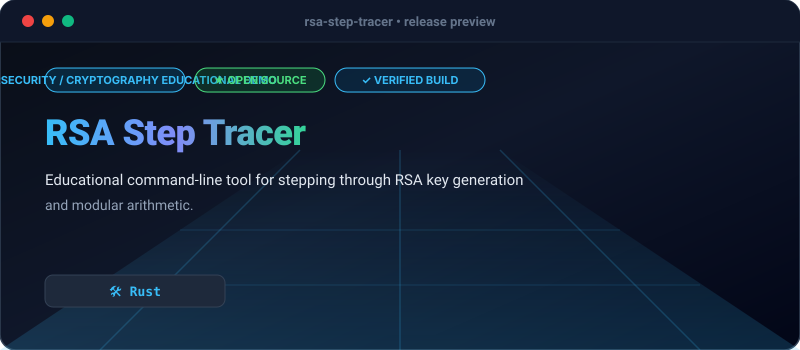

# RSA Step Tracer

[](https://github.com/Olamideakinade/rsa-step-tracer)
[](https://opensource.org/licenses/MIT)



`rsa-step-tracer` is a command-line tool designed for cryptography students and educators to inspect the intermediate calculations of the RSA asymmetric encryption algorithm. It provides verbose logging for prime generation, modular inverse computation via the Extended Euclidean Algorithm, and modular exponentiation.

## Key Capabilities

- **Extended Euclidean Algorithm Trace**: Step-by-step display of Bézout coefficients during modular inverse calculation for private key derivation.
- **Modular Exponentiation Inspection**: Traces binary square-and-multiply operations for encryption and decryption.
- **Parameter Validation**: Checks input primes for primality and ensures coprimality between public exponent $e$ and $\phi(n)$.

## Terminal Demonstration

```bash
$ cargo run -- --p 61 --q 53 --e 17 --msg 65

[INFO] Starting RSA Key Generation & Encryption Trace
[STEP 1] Modulus Calculation
  p = 61, q = 53
  n = p * q = 3233
  Totient phi(n) = (p - 1) * (q - 1) = 3120

[STEP 2] Public Exponent Validation
  Chosen e = 17
  gcd(17, 3120) = 1 (Valid coprime)

[STEP 3] Private Exponent Derivation (Extended GCD)
  Computing d = e^(-1) mod phi(n)...
  d = 2753

[STEP 4] Encryption
  Plaintext: 65
  Ciphertext = m^e mod n
  Ciphertext: 413

[STEP 5] Decryption
  Ciphertext: 413
  Plaintext = c^d mod n
  Plaintext: 65 (Match successful)
```

## Quickstart

Clone the repository and run with custom prime numbers and a message:

```bash
git clone https://github.com/Olamideakinade/rsa-step-tracer.git
cd rsa-step-tracer
cargo run -- --p 61 --q 53 --e 17 --msg 65
```

## Architecture

The codebase is structured into modular units handling core math primitives, big integer arithmetic wrappers, and command-line argument parsing.

- `src/math.rs`: Implements number-theoretic algorithms (GCD, Extended GCD, modular exponentiation, trial division primality testing).
- `src/rsa.rs`: Core data structures and algorithmic steps for RSA key generation, encryption, and decryption.
- `src/main.rs`: CLI interface parsing arguments and formatting output.

## License

MIT
